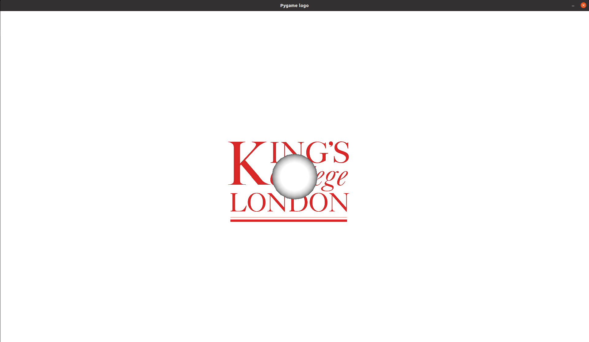

# SOFA-PyGame

This repository contains a short tutorial on how to use PyGame as the GUI for our own simulation scene. Using Pygame as our rendering tool, gives as more freedom to introduce and draw new objects in the scene such as logos or images in the simulation background.

## Requirements
To run this demo you will need some extra python packages in your environment. You can directly install using `pip install -r requirements.txt`.

## Scene
The scene contains a very simple examples on how to render the **King's Logo** into the background of a Sofa simulation scene. In the future the plan is to add more functionalities for pygame in this repository so we can present more complex scenarios. To run the scene you just need to call the sofa scene using the python interpreter `python3 pygame-scene.py`. Below there is an example of what you should see from the scene, you can exit the simulation using the *Esc* key.

